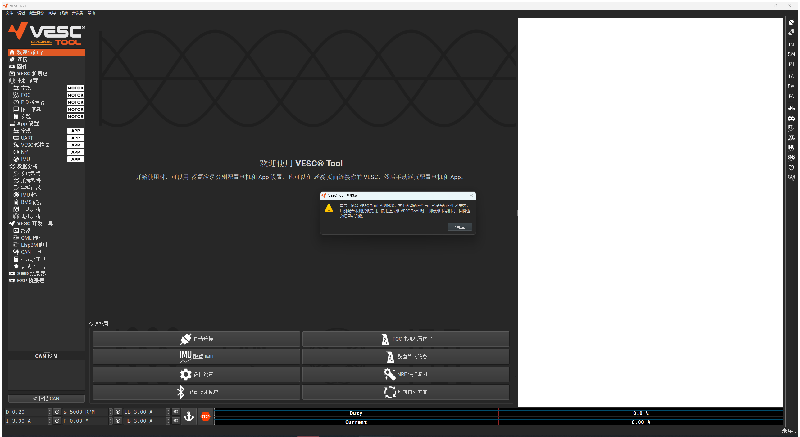
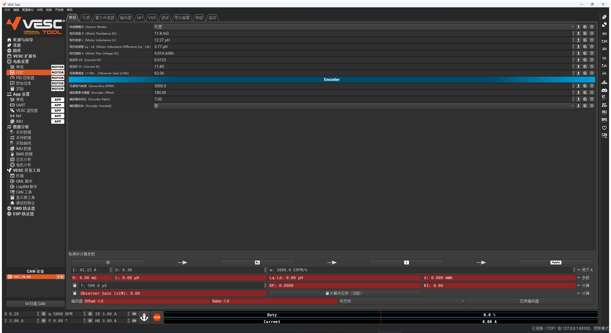
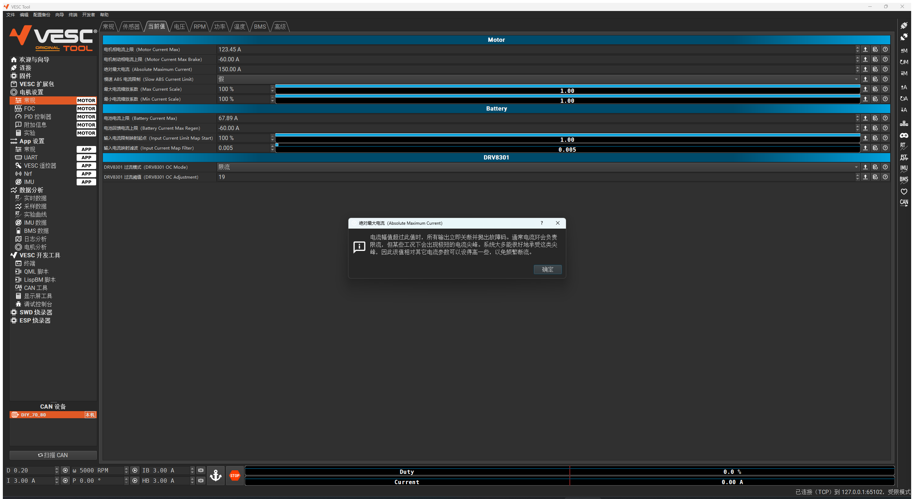
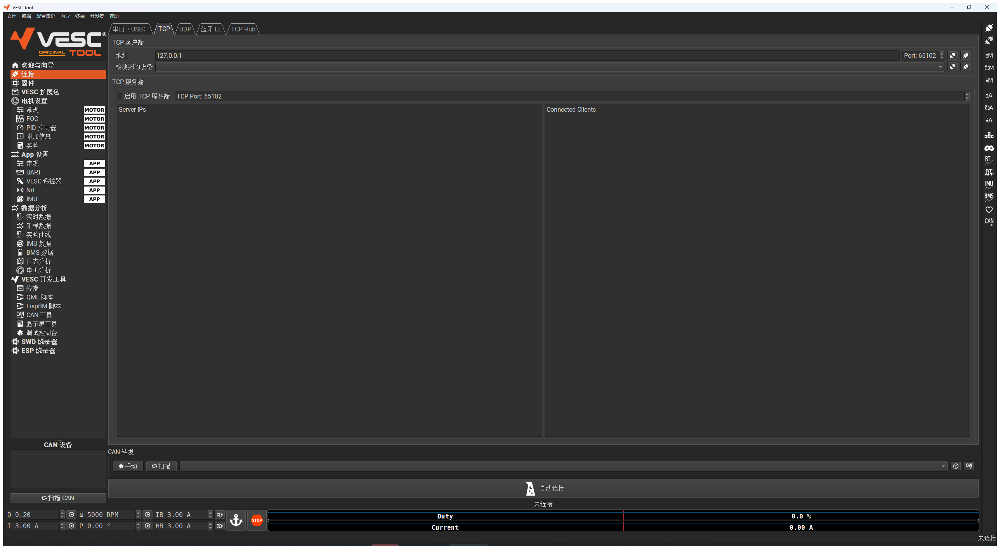
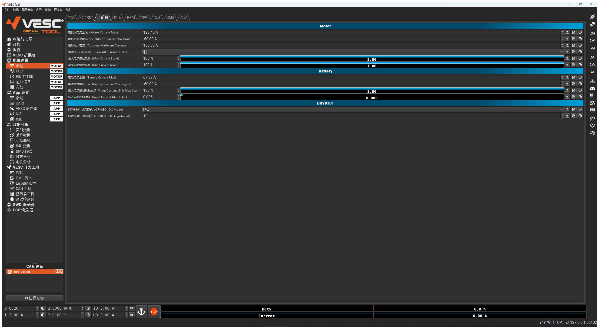
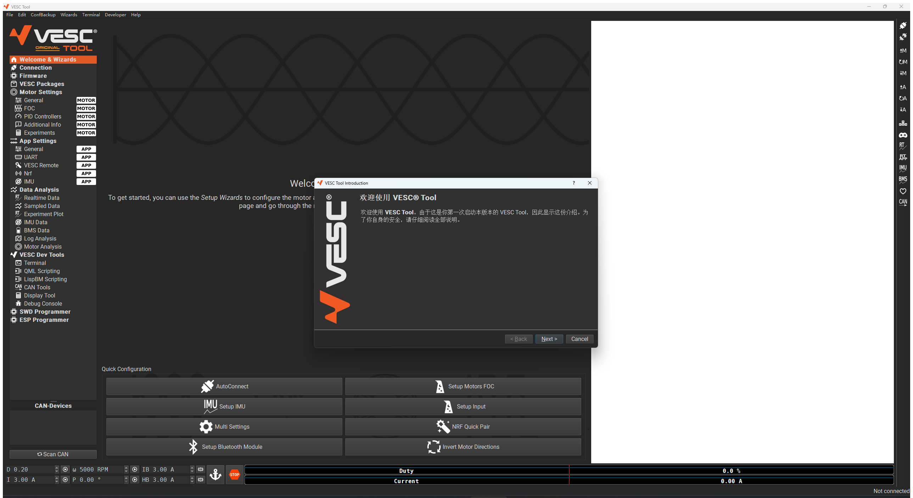
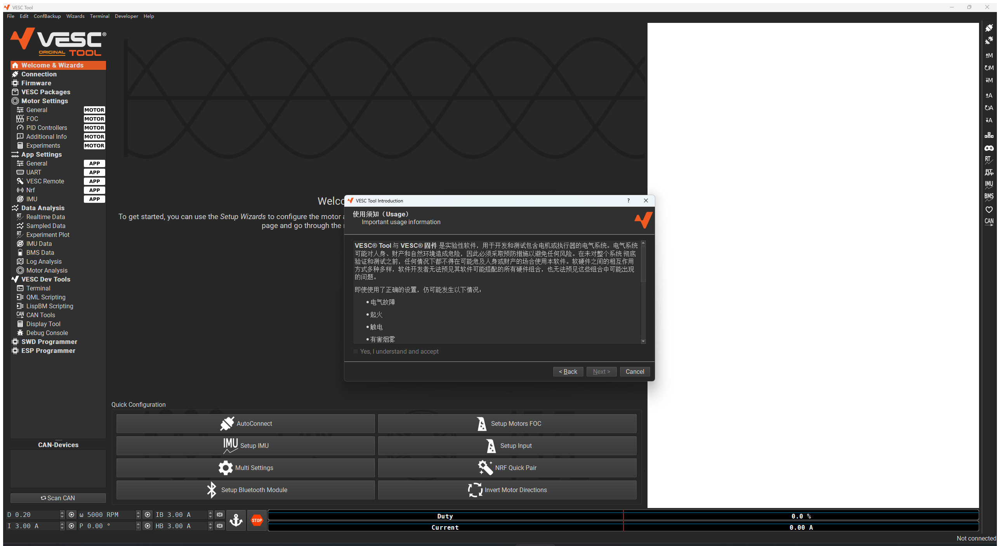

<p align="center">
  
</p>

<h1 align="center">VESC Tool 简体中文版</h1>

<p align="center">
  <b>汉化状态：已完成</b> · 界面 · 参数 · 帮助文本 · 悬停提示 全部中文<br>
  <sub>Windows x64 · 开箱即用 · 不需要安装 Qt</sub>
</p>

<p align="center">
  <code>汉化版 v1.2</code> ·
  <code>VESC Tool 7.00</code> ·
  <code>固件配置 6.06 / 7.00 / 7.01</code> ·
  <code>Windows x64</code> ·
  <code>GPL-3.0</code>
</p>

<p align="center">
  <b>📖 <a href="TUTORIAL.md">使用教程：从电机参数识别到速度控制启动电机</a></b> ·
  <b>🧪 <a href="TEST_REPORT.md">全功能复测报告</a></b>
</p>

> **v1.1 用户请更新**：v1.1（2026-09-07）的程序包漏打了几个 QML 运行库，欢迎页右侧是空白的、
> **FOC 电机配置向导点了没反应**。v1.2 已修复，请从 [Gitee 发行版](https://gitee.com/wowhywhat/vesc_-tool_-cn/releases) 或 GitHub 的 [`release` 分支](https://github.com/whatThelp/VESC_Tool_CN/tree/release) 下载新包，整个替换 `vesc_tool_cn_win64` 目录。

---

## 版本信息

| 项目 | 版本 |
|---|---|
| **汉化版本** | **v1.2**（2026-09-23，全功能复测后修复；v1.1 为 2026-09-07） |
| **VESC Tool 版本** | **7.00**（`VT_VERSION = 7.00`，`VT_IS_TEST_VERSION = 0`，正式版非测试版） |
| **上游源码** | [vedderb/vesc_tool](https://github.com/vedderb/vesc_tool) `master` · commit `dc53c658cbb89a947246034f7a00149cf79abdfc` |
| **配置版本** | `VT_CONFIG_VERSION = 4` |
| **已汉化的固件配置** | **6.06 / 7.00 / 7.01**（其余 22 个版本目录保持英文原版） |
| **编译环境** | Qt **5.15.2**（win64_mingw81）+ MinGW-W64 GCC **8.1.0** |
| **构建参数** | `CONFIG += release_win build_original exclude_fw` · **0 error / 0 warning** |
| **可执行文件** | `vesc_tool_cn.exe` · PE32+ x86-64 · 20.9 MB |

> **这是一个已经完成的汉化版本，不是半成品。** 菜单、左侧导航、按钮、右侧工具栏悬停提示、
> 参数标签、下拉选项、帮助文本、设置向导、对话框、以及 Qt 自身的标准控件文案，全部已汉化。
> 详细覆盖率见下表，未汉化的部分都是**刻意保留**的英文（原因见后）。

<details>
<summary><b>关于「VESC Tool 7.00」这个版本号</b>（点开看说明）</summary>

上游 vesc_tool 仓库**一个 git tag 都没有**（`git ls-remote` 只返回 `HEAD` 和
`refs/heads/master`），官方的 7.00 是某个时间点的 master 直接编译出的二进制，没有单独的
7.00 源码分支可以 checkout。

所以本版本的做法是：用 master 的源码（commit `dc53c658`），把 `.pro` 里的
`VT_VERSION` 设为 `7.00`、`VT_IS_TEST_VERSION` 设为 `0` 后编译。这样：

- 离线时默认加载 **7.00** 的参数定义
- 连接 7.00 固件时进入**正常模式**，不弹「有固件更新可用」提示
- 启动不再弹「VESC Tool 测试版」提示
- 唯一的妥协：代码本身仍是 master 的代码，只是版本号标 7.00。对调参没有影响
  （参数定义来自 XML，用的就是 7.00 那份），差别只在 7.01 之后新增的功能仍然存在。

</details>

---

## 截图

### 主界面 · 左侧导航与菜单全中文


### FOC 参数页 · 参数标签采用「中文（English）」双语



### 参数帮助 · 长篇说明文本已完整汉化

点击任意参数右侧的 <kbd>?</kbd> 按钮即可弹出。



### 右侧工具栏悬停提示

鼠标移到右侧工具栏图标上弹出的提示，也全部是中文。


### 连接页 · 电机参数页





> 上图里 `123.45 A` / `67.89 A` 是设备模拟器注入的特征值，用来验证配置读取正常 —— 见
> [验证](#验证)一节。

### 首次启动向导

 

---

## 汉化覆盖率

| 位置 | 覆盖率 | 说明 |
|---|:---:|---|
| 配置 XML 参数标签 `longName` | **100%** | 6.06 / 7.00 / 7.01 三个版本 |
| 配置 XML 帮助文本 `description` | **~99%** | 即上图那种长篇说明 |
| 配置 XML 下拉选项 `enumNames` | ~65% | 其余是固件宏名与常量，见下 |
| `.ui` 按钮 / 标题 / **悬停提示** | **93%** | 1125 / 1202 条 |
| `.ui` 选项卡标题 | **88%** | 104 / 117 条 |
| `.qml` 界面文本 | **97%** | 431 / 441 条 |
| `.cpp` 的 `tr()`（对话框、状态栏、向导） | **97%** | 705 / 720 条 |
| Qt 标准控件（确定 / 取消 / 文件对话框…） | **已补齐** | 原版是英文，见下 |

译文词典共 **3179 条**，全部在 `tools/trans/` 里。

### 为什么不是 100%

剩下的都是**刻意保留**的英文，翻了反而会出问题：

- **许可证与免责条款正文** —— GPL 全文、iOS 许可证、保修声明。译文没有法律效力。
  （同一页的「使用须知」是安全操作指引，不是条款，**已翻译**）
- **固件宏名与枚举常量** —— `FOC_OBSERVER_MXLEMMING`、`CAN_BAUD_500K`、`IMU_TYPE_*`、
  `AHRS_MODE_*`、`BATTERY_TYPE_*`。这些和固件里的字符串一一对应，翻了对不上资料。
- **型号 / 单位 / 格式名** —— `AS5047 Encoder`、`KTY84/130`、`PT1000`、`RGB565`、
  `250 Hz`、`-18 dBm`、`STM32F40x`、`NRF52840 1M/256K`。
- **代码与命令** —— LispBM / QML 的 API 自动补全条目（`setDutyCycle(duty)`、`Math.sqrt(x)`）、
  终端命令 `help`、主机名、曲线图例缩写（`TM`/`TF`/`IM`/`II`/`VBus`）。

参数标签统一用 `中文（English）` 的形式，例如 `电机相电流上限（Motor Current Max）` ——
保留英文原文是为了还能对上网上的教程和论坛帖。

---

## 下载与使用

> 编译好的程序不放在 master 里：国内从 [Gitee 发行版](https://gitee.com/wowhywhat/vesc_-tool_-cn/releases) 下载；GitHub 上放在单独的 [`release` 分支](https://github.com/whatThelp/VESC_Tool_CN/tree/release)（[直接下载 zip](https://github.com/whatThelp/VESC_Tool_CN/raw/release/VESC_Tool_CN_v1.2_win64.zip)）。master 只存源码、配置、脚本和文档，Gitee 与 GitHub 的 master 完全一致。

### 方式 A：直接用编译好的程序（推荐，中文最完整）

下载 **`VESC_Tool_CN_v1.2_win64.zip`**（地址见上），解压后双击 `vesc_tool_cn_win64\vesc_tool_cn.exe`。
Qt 运行时和 MinGW 运行时都在目录里，**不需要安装 Qt**。

### 方式 B：不重编译，给现有官方版换中文配置

如果你想继续用官方原版 `vesc_tool_7.00.exe` / `7.01`，只把参数和帮助换成中文：从 Gitee 发行版或 GitHub `release` 分支下载
`res_config_cn_for_official.rcc`（也可以用 `tools/build_rcc.py` 自己打包），然后

```bat
copy res_config_cn_for_official.rcc "%APPDATA%\VESC\VESC Tool\res_config.rcc"
```

然后正常启动官方版即可，参数标签和帮助文本变中文。删掉这个文件就还原。

> ⚠ 这一份的**下拉选项保持英文**，原因见下面的「配置签名」。想要中文下拉请用方式 A。
>
> 包内含全部 25 个版本目录（6.06/7.00/7.01 中文，其余英文原版）+ `fw.xml`，不会丢掉对其它
> 固件版本的支持。官方的「下载配置」功能会覆盖同一路径，覆盖后重拷一次即可。

---

## 固件版本怎么切换

**连上电调后是自动的，不用管。** 连接时程序读到固件版本，只要
`res/config/<版本>/` 存在，就会调用 `Utility::configLoad()` 把那一版的参数定义加载进来
（`vescinterface.cpp:3743`）。也就是说：

| 你的固件 | 参数页显示 | 是否中文 |
|---|---|---|
| 7.00 | `res/config/7.00/` | ✅ 中文 |
| 7.01 | `res/config/7.01/` | ✅ 中文 |
| 6.06 | `res/config/6.06/` | ✅ 中文 |
| 其它（3.55～6.05） | 对应版本目录 | 英文原版 |

**离线时想手动切**：菜单 `开发者` → `加载固件配置` → 选版本。这个子菜单是上游自带的，
列出全部 25 个版本，点一下立即生效。

本版本离线时默认加载 **7.00**（由 `VT_VERSION` 决定）。连接 **7.01** 固件时会进入受限模式并
提示「固件比本版本 VESC Tool 支持的更新」—— 受限模式只屏蔽老版本不认识的新命令，
`GET/SET_MCCONF`、`GET/SET_APPCONF` 都在放行名单里，**调参不受影响**。

---

## ★ 配置签名：一个必须注意的点

`ConfigParams::getSignature()` 把 `enumNames`（下拉选项）的**文本**算进配置签名，而固件端的
签名常量是按**英文 XML** 生成的。

> **把下拉选项翻成中文，签名就会对不上，读写电机 / App 配置会被判 `Invalid signature` 直接失败。**

本项目的修法：在 XML 里额外保存一份英文原名 `<enumNamesSig>`，让签名只用它计算，界面照常
显示中文；没有该元素时自动回退到 `enumNames`，对原版 XML 行为不变。

三个版本、六个配置文件的签名实测：

| 配置文件 | 原版（英文） | 汉化 + 未打补丁 | 汉化 + 打了补丁 |
|---|---|---|---|
| 6.06 / mcconf | `0x2EFD0142` | `0xB5ACE0F0` ❌ | **`0x2EFD0142`** ✅ |
| 6.06 / appconf | `0x7D217EB8` | `0x1F6772EA` ❌ | **`0x7D217EB8`** ✅ |
| 7.00 / mcconf | `0x57AD8F53` | `0xB96DF024` ❌ | **`0x57AD8F53`** ✅ |
| 7.00 / appconf | `0x8E195E93` | `0xBFC07F4F` ❌ | **`0x8E195E93`** ✅ |
| 7.01 / mcconf | `0xBC09F8B0` | `0xA8E12AEB` ❌ | **`0xBC09F8B0`** ✅ |
| 7.01 / appconf | `0x11ADA6CC` | `0x452908B1` ❌ | **`0x11ADA6CC`** ✅ |

所以给**官方原版 exe** 用的外挂配置包必须保持英文下拉（官方 exe 没有这个补丁）。

---

## 目录结构

```
（发行版 / release 分支）VESC_Tool_CN_v1.2_win64.zip   程序包，解压得到下面这个目录（145 MB，不在 master 里）
vesc_tool_cn_win64/
  ├─ vesc_tool_cn.exe              主程序
  ├─ translations/qt_zh_CN.qm      Qt 自带简体中文
  ├─ translations/vesc_cn_extra.qm 自制补充翻译（标准按钮）
  ├─ libssl-1_1-x64.dll / libcrypto-1_1-x64.dll   OpenSSL 1.1.1w（HTTPS 功能用）
  └─ licenses/OpenSSL-1.1.1-LICENSE.txt
config_cn_builtin/{6.06,7.00,7.01} 本 exe 内置的配置（中文下拉 + enumNamesSig）
config_cn_official/{6.06,7.00,7.01} 给官方原版 exe 用的配置（英文下拉）
（发行版 / release 分支）res_config_cn_for_official.rcc   上面那份打成的外挂资源包（tools/build_rcc.py 生成）
patches/source_patches.diff        对上游源码的功能性改动（5 处）
patches/full_source.diff           完整源码改动（198 个文件，含全部翻译；打到上游原版上即为编译本 exe 的源码）
tools/                             汉化流水线脚本 + 3179 条译文词典 + VESC 设备模拟器
screenshots/                       实机截图
docs/img/                          教程和测试报告的配图
TUTORIAL.md                        使用教程：参数识别 → 速度控制启动电机
TEST_REPORT.md                     全功能复测报告（v1.2）
MANIFEST.md                        完整交付说明（校验和、验证过程、已知问题）
```

---

## 对上游源码的改动

除字符串替换外**只有五处**，完整补丁见 [`patches/source_patches.diff`](patches/source_patches.diff)
（在上游源码根目录 `patch -p1 < source_patches.diff`，已自检可干净打上）：

| 文件 | 改动 | 为什么 |
|---|---|---|
| `main.cpp` | 加载 `qt_zh_CN.qm` 和自制的 `vesc_cn_extra.qm` | 原版没装 `QTranslator`；且 Qt 5.15 的 `qt_zh_CN.qm` 缺 `QPlatformTheme` 上下文，标准按钮本来是英文 |
| `configparam.h` | 新增 `enumNamesSig` 字段 | 见上面的「配置签名」 |
| `configparams.cpp` | 解析 `<enumNamesSig>`，签名改用它计算 | 同上 |
| `mainwindow.cpp` | `Terminal` / `QML Scripting` / `LispBM Scripting` 三个页面名成对替换 | `addPageItem()` 和 `showPage()` 共用同一字符串当页面键，只翻一边会打断页面跳转 |
| `utility.h/.cpp` 等 | 新增 `Utility::detectResultZh()`，FOC 检测结果对话框显示中文 | 检测结果文本同时被拿来判断成败（`startsWith("Success!")`），只能在显示处翻译 |

---

## 验证

> **v1.2 做了一次全功能复测**：用带电机物理模型的 7.00 固件模拟器
> [`tools/vesc_emu.py`](tools/vesc_emu.py) 走通了「连接 → 参数识别 → 识别成功 → 速度控制启动电机」，
> 以及配置读写、识别失败、底部全部控制按钮、急停、保活、实时数据、终端、33 个页面巡检，
> 共 99 项全部通过，详见 [TEST_REPORT.md](TEST_REPORT.md)。下面是 v1.1 时做的首轮验证。

没有实机电调，所以写了 [`tools/vesc_sim.py`](tools/vesc_sim.py) —— 用 VESC 的包协议在 TCP 上
模拟一台跑 6.06 固件、硬件名 `DIY_70_80` 的电调。它实现了分帧 + CRC16、`COMM_FW_VERSION`、
`COMM_GET_VALUES`、以及按 `SerOrder` 和各参数 `vTx` 类型**完整序列化的配置**
（含 `vbAppendDouble32Auto` 的浮点编码）。关键点：**它的签名一律用原版英文 XML 计算**，
和真实固件一致。

```bash
python tools/vesc_sim.py <原版vesc_tool>/res/config/6.06 65102 6 6
```

然后在 VESC Tool 的「连接 → TCP」里连 `127.0.0.1:65102`（默认值就是它）。

| 验证项 | 结果 |
|---|---|
| 程序启动、主窗口 | ✅ 菜单 / 导航 / 按钮 / 状态栏全中文 |
| 首启向导 | ✅ 两页中文，排版正常 |
| 连接 | ✅ `已连接（TCP）到 127.0.0.1:65102`，CAN 设备列表出现 `DIY_70_80 [本机]` |
| **读取电机 / App 配置** | ✅ 模拟器按**英文签名**发出配置，VESC Tool 正常接收并解出 |
| **配置数值** | ✅ 注入的特征值原样显示：电机相电流上限 **123.45 A**、电池电流上限 **67.89 A** |
| 中文下拉值 | ✅ `DRV8301 过流模式` = `限流` |
| 右侧工具栏悬停提示 | ✅ 悬停 ↑M 弹出「读取电机配置」 |
| Qt 标准按钮 | ✅ 消息框按钮显示「确定」 |

**这端到端确认了签名修复是对的** —— 如果签名不匹配，配置会被直接拒收，界面上不可能出现那两个数。

静态校验：68 个 `.ui` 全部通过 XML 解析、90 个 `.qml` 全部通过 `qmllint`（与原版一致 0 失败）、
配置 XML 结构指纹五项校验全部 OK、完整重编译 0 error / 0 warning，并扫过所有被翻译的行确认
没有字符串被程序自己拿去比较或解析（`%1` 占位符全部完好）。

---

## 换新版本时怎么重跑

`tools/` 下是整套流水线，词典按**英文原文的 md5** 索引，没变过的条目会自动命中，
只需要翻新增的部分：

```bash
python tools/extract.py  <vesc_tool>/res/config/7.02 work/     # 抽取
python tools/mkbatch.py  work/ 9000                            # 切批次，翻译成 trans/*.json
python tools/apply.py    <vesc_tool>/res/config/7.02 tools/trans out/   # 回填
python tools/add_sig.py  <原版>/res/config/7.02 out/            # 补 enumNamesSig
python tools/verify.py   <原版>/res/config/7.02 out/            # 校验
```

回填一律是「只替换片段所占的那一段字节，其余逐字节保留」，并自动保留原文前后空白，
所以 diff 干净、缩进不变。

界面部分（`.ui` / `.qml` / `.cpp`）用 `extract2.py` / `apply2.py` 回填后，再按顺序跑这几个修正脚本
（都可重复执行）：

```bash
python tools/fixup.py         <源码根>   # 位域 Unused、页面名、vesc_cn_extra 加载、数值框前缀等
python tools/fix_detect_zh.py <源码根>   # 检测结果中文显示
python tools/fix_round3.py    <源码根>   # v1.2 复测时补的遗留英文、参数分组标题
python tools/fix_cjk_space.py <源码根>   # 去掉中文拼接处多余的空格
python tools/make_patch.py    <上游源码根> patches/source_patches.diff out.diff   # 重新生成功能补丁
```

打包必须同时扫描两个 QML 目录，否则会漏掉向导需要的模块（v1.1 就栽在这里）：

```bash
windeployqt --compiler-runtime --qmldir <源码根>/mobile --qmldir <源码根>/res/qml vesc_tool_cn.exe
```

再把 `qt_zh_CN.qm`、`vesc_cn_extra.qm` 拷进 `translations/`。

### 踩过的坑

- `.ui` 里 `<string notr="true"/>` 是自闭合标签且本就标记「不翻译」，正则只匹配无属性的
  `<string>` 才安全，否则会吞掉一大段 XML。
- C++ / QML 里 `"前半句 " "后半句"` 和 `"a" + "b"` 的拼接必须一并抓，否则界面上会剩半句英文。
- 「内容不得含 `<`」这条保险只能用于 `.ui`；C++ / QML 里 `<br>`、`<b>` 是合法文本。
- `tr()` 是 Qt 里「这段给用户看」的标记，是最可靠的抓取入口。
- `windeployqt` **不能加 `--release`** —— 它会把 MinGW 的 release 插件误判成 debug 而全部
  过滤掉，报 `Unable to find the platform plugin.`。

---

## 已知问题

1. 版本号是 `7.00`，但代码取自上游 master（上游没有 7.00 的 tag，见「关于版本号」）。
   连接 **7.01** 固件会进入受限模式并提示固件更新，调参本身不受影响。
2. `VT_GIT_COMMIT` 为空 —— 「关于」里该字段是空的（源码是 tar 包，无 `.git`）。
3. 参数编辑器另存 XML 会丢 `enumNamesSig`，重新跑一次 `tools/add_sig.py` 即可补回。
4. 模拟器未实现 IMU、BMS、统计等命令，相关页面连模拟器时没有数据。这是模拟器的边界，不是汉化的问题。
5. v1.2 已把左侧 33 个页面逐页截图巡检过，没发现撑坏或截断；各页内的子选项卡没有逐个点开。

---

## 许可与商标

- 程序目录附带 **OpenSSL 1.1.1w**（`libssl-1_1-x64.dll`、`libcrypto-1_1-x64.dll`，[FireDaemon](https://www.firedaemon.com/get-openssl) 的 Windows 构建，Authenticode 签名有效，源自 OpenSSL 官方 tag `OpenSSL_1_1_1w`），供固件下载、扩展包商店等 HTTPS 功能使用。Qt 5.15.2 只能加载 1.1.x 系列；1.1.1 已于 2023-09 停止官方维护，这里只用于 VESC Tool 访问 vesc-project.com。许可证原文见 `vesc_tool_cn_win64/licenses/OpenSSL-1.1.1-LICENSE.txt`。*This product includes software developed by the OpenSSL Project for use in the OpenSSL Toolkit (http://www.openssl.org/).*

- VESC Tool 采用 **GNU GPL v3**，本仓库同样遵循，[`LICENSE`](LICENSE) 为上游许可证原文。
- 完整源码见上游仓库 <https://github.com/vedderb/vesc_tool>
  （commit `dc53c658cbb89a947246034f7a00149cf79abdfc`），本仓库的改动全部在
  [`patches/full_source.diff`](patches/full_source.diff) 里（在上游源码根目录 `patch -p1 --binary < full_source.diff`，
  得到的就是编译 `vesc_tool_cn.exe` 所用的源码，已逐字节核对）。
- **VESC® 是 Benjamin Vedder 的注册商标。** 上游明确不鼓励在官方渠道之外发布 VESC Tool 的
  二进制版本，参见 [trademark policies](https://vesc-project.com/trademark_policies)。
  **本仓库仅作个人调参自用，不是官方发布，也不代表 VESC Project。**
  官方版本请从 <https://vesc-project.com/> 下载。
