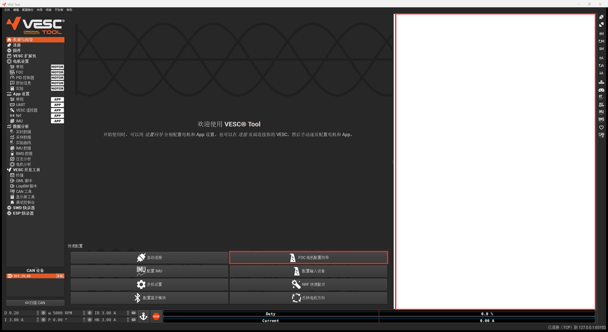
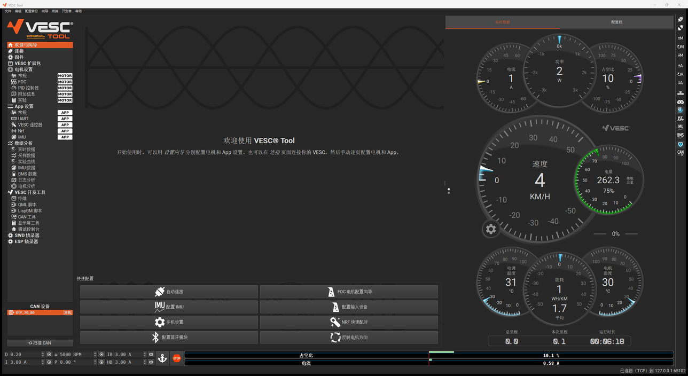

# VESC Tool 汉化版 —— 全功能复测报告

| 项 | 内容 |
|---|---|
| 测试日期 | 2026-09-23 |
| 被测程序 | `vesc_tool_cn_win64/vesc_tool_cn.exe`（汉化版 v1.2，VESC Tool 7.00，上游 master `dc53c658`） |
| 对照 | 上一版发布包（汉化版 v1.1，2026-09-07） |
| 固件 | **7.00**（与你板子上的固件一致），硬件名 `DIY_70_80` |
| 设备 | 没有实机，用 [`tools/vesc_emu.py`](tools/vesc_emu.py) 模拟电调 + 电机（见第 6 节） |
| 连接方式 | TCP `127.0.0.1:65102`（模拟器）。USB 串口本机无法模拟，未测 |

---

## 1. 结论：是程序的问题，不是你不会用

**上一版发布包（v1.1）确实有一个严重缺陷**：程序目录里少了几个 QML 运行库，导致

- 欢迎页右侧整块面板是**空白**的；
- 点「FOC 电机配置向导」**没有任何反应**，参数识别这一步根本走不下去。

这正好卡在「电机参数识别」的第一步，看起来就像「不会用」。
根因是打包命令 `windeployqt` 只扫描了 `res/qml` 目录，没扫描向导所在的 `mobile/` 目录，
于是 `QtQuick.Dialogs`、`Qt.labs.*`、`Qt3D` 等模块没被打进包里。**已修复并重新打包**，
修复后的整套流程（连接 → 识别 → 识别成功 → 速度控制启动电机）已完整走通。

<table><tr>
<td><b>修复前（v1.1 发布包）</b><br><br>右侧空白，点向导按钮无反应</td>
<td><b>修复后（v1.2）</b><br><br>面板和仪表盘正常，向导可用</td>
</tr></table>

除此之外还修了 6 类问题（识别结果是英文、若干遗留英文、位域参数误显示、源码补丁不完整等），并补上了 OpenSSL（联网功能），
见第 3 节。另有 **5 个原版就是这样设计、但很容易让人以为「坏了」的地方**，见第 4 节 ——
建议先看这一节，再按 [TUTORIAL.md](TUTORIAL.md) 操作。

---

## 2. 测试结果总览

| 类别 | 用例 | 通过 | 说明 |
|---|:---:|:---:|---|
| 启动与连接 | 4 | 4 | USB 串口未测（无设备） |
| 配置读写 | 7 | 7 | 签名与 7.00 固件一致 |
| 电机参数识别（新版 QML 向导） | 9 | 9 | 全流程 |
| 电机参数识别（旧版对话框） | 5 | 5 | 含识别失败路径 |
| 电机控制（底部控制栏） | 10 | 10 | 位置模式模拟器未建模，只验证命令下发 |
| 实时数据与仪表 | 4 | 4 | |
| 终端 | 3 | 3 | |
| 页面巡检（左侧 33 个导航页） | 33 | 33 | 全部能打开、无空白、无崩溃 |
| 模拟器协议自检 | 24 | 24 | `tools/emu_selftest.py` |
| **合计** | **99** | **99** | |

### 2.1 启动与连接

| 用例 | 结果 |
|---|---|
| 启动主窗口，菜单 / 导航 / 状态栏为中文 | ✅ |
| 欢迎页右侧面板（设备扫描、仪表盘）正常显示 | ✅（v1.1 空白，已修复） |
| 连接页 → TCP → 连接，状态栏显示「已连接（TCP）到 127.0.0.1:65102」 | ✅ |
| 连接 7.00 固件为正常模式（无「受限模式」、不弹固件更新），CAN 设备列表出现 `DIY_70_80 [本机]` | ✅ |

### 2.2 配置读写（模拟器按**原版英文 XML** 计算签名，与真实固件一致）

| 用例 | 模拟器日志 / 结果 |
|---|---|
| 连接后自动读取电机、App 配置 | ✅ `get_mcconf` / `get_appconf` |
| 写入电机配置（右侧工具栏 ⇡M） | ✅ `set_mcconf ok sig=0x57AD8F53 changed=17` |
| 写入 App 配置 | ✅ `set_appconf ok sig=0x8E195E93` |
| 读取默认配置（向导「载入默认参数」） | ✅ `get_mcconf default=true` → 写回，签名正确 |
| 超出硬件上限的值被截断，并弹「参数被截断」提示 | ✅（相电流 > 80 A 截断到 80 A） |
| 签名错误时固件拒收（模拟器打印 `Could not set mcconf due to wrong signature`） | ✅ 汉化版从未触发 |
| 分组标题中文化后签名不变（分组不参与签名计算） | ✅ 重新编译后写配置仍 `ok` |

### 2.3 电机参数识别 —— 新版向导（欢迎页「FOC 电机配置向导」）

模拟电机：7 对极，R = 28.5 mΩ，L = 21.6 µH，Lq−Ld = 5.8 µH，λ = 5.17 mWb，12S 46.8 V。

| 步骤 | 结果 |
|---|---|
| 载入默认参数 → 是 | ✅ |
| 用途页（通用 / 电动滑板 / 平衡车 / 螺旋桨） | ✅ 中文 |
| 电机页，选「中型外转子（约 750 g）」→ 下一步 → 确认警告 | ✅ 最大功率损耗 120 W、开环 700 ERPM |
| 电池页：按当前电压自动估出 **12 串** | ✅（39~51 V 时向导自动填 12） |
| 设置页：传动比、轮径、极数 14 | ✅ |
| 运行检测 → 确认「检测 FOC 参数」 | ✅ 检测约 12 秒，模拟电机转起来 |
| **检测结果**：检测成功！R 27.4 mΩ、L 21.16 µH、Lq−Ld 6.34 µH、λ 5.20 mWb、电流上限 54.07 A | ✅ 与模拟电机一致（误差来自模拟的测量噪声），**结果为中文** |
| 方向页：正转测试（占空比 0 → 0.1 爬升，2 秒后释放） | ✅ |
| 完成 → FOC 页显示新参数（R/L/λ/KP/KI/观测器增益） | ✅ 与固件写回的值一致 |

固件端写回的值与固件公式一致：电流上限 = √(120 W / R / 1.5) = 54 A（< 硬件 80 A），
绝对最大电流 = 1.5 × 54 = 81 A，KP = L × 1000，KI = R × 1000，观测器增益 = 1000 / λ²。


### 2.4 电机参数识别 —— 旧版对话框（菜单「向导 → FOC 电机配置向导（旧版）」）

| 用例 | 结果 |
|---|---|
| 电机 / 电池 / 设置 / 方向四段，标题与警告为中文 | ✅（「Motor/Battery/Setup/Directions」已汉化） |
| 运行检测（不含 CAN 从机） → 检测成功，结果中文 | ✅ |
| **识别失败路径**：终端输入 `emu_fault uv` 注入欠压 → 再检测 | ✅ 弹「检测失败，原因：欠压故障……请确认它的限流值足够大」 |
| 方向页「本机 VESC」+ 正转 / 反转按钮 | ✅ |
| 打开时电池串数被重置为 **3** | ⚠ 原版行为，见第 4 节 |


### 2.5 电机控制（窗口底部控制栏）

| 用例 | 结果 |
|---|---|
| ω 5000 → ▶：转速稳定在 5000 ERPM，占空比 10.1%，电机电流 0.58 A | ✅ |
| ω 改 10000 → ▶：转速跟随到 10000 ERPM | ✅ |
| 目标 500 ERPM（低于「最小电气转速」900）→ 电机不转 | ✅ 与固件一致，见第 4 节 |
| D 0.20 → ▶：占空比 20%，约 10000 ERPM | ✅ |
| I 3.00 A → ▶：恒电流加速 | ✅ |
| IB 3.00 A → ▶：制动减速到 0 | ✅ |
| HB 3.00 A → ▶：手刹 | ✅ |
| P 0.00° → ▶：位置模式命令下发 | ✅ 命令到达（模拟器未建模位置环） |
| **STOP**：电流置 0 + 急停 5 秒，期间再按 ▶ 被忽略；5 秒后恢复 | ✅ 与固件一致，见第 4 节 |
| 关闭「保活」→ 1 秒后超时停机 | ✅ |

### 2.6 实时数据与仪表

| 用例 | 结果 |
|---|---|
| 右侧工具栏 RT 按钮打开后，实时数据页曲线与数值刷新 | ✅（**不打开就一直是 0**，见第 4 节） |
| 电流 / 温度 / 转速 / FOC / 转子位置 选项卡 | ✅，坐标轴与图例为中文 |
| 欢迎页仪表盘（电流、功率、占空比、速度、电量、温度、能耗） | ✅ 中文 |
| 底部占空比 / 电流指示条 | ✅ 中文 |

### 2.7 终端

| 用例 | 结果 |
|---|---|
| `faults` | ✅ `No faults registered since startup` |
| `hw_status` | ✅ 固件版本、硬件名、电压、温度 |
| 模拟器扩展命令 `emu_fault uv` | ✅ |

### 2.8 页面巡检

左侧导航全部 33 页逐个打开截图，全部正常显示，无空白、无报错弹窗、无崩溃。
缩略图见 [`docs/img/pages/`](docs/img/pages/)（sheet01 ~ sheet09）。

---

## 3. 发现并已修复的问题

| # | 严重度 | 问题 | 根因 | 修复 |
|---|:---:|---|---|---|
| 1 | **严重** | 欢迎页右侧空白，**FOC 电机配置向导打不开** | 打包时 `windeployqt` 只扫描了 `res/qml`，没扫描 `mobile/`，缺 `QtQuick.Dialogs`、`QtQuick.PrivateWidgets`、`Qt.labs.{folderlistmodel,platform,settings}`、`QtQuick.Scene3D`、`Qt3D` 等模块 | 用 `--qmldir mobile --qmldir res/qml` 重新打包（新增 92 个文件） |
| 2 | 中 | 检测结果对话框是英文 | 结果文本在 `Utility::detectAllFoc()` 里生成，同时被程序拿来判断成败（`startsWith("Success!")`），不能直接翻 | 新增 `Utility::detectResultZh()`，只在显示处翻译；判断仍用英文原文 |
| 3 | 中 | 位域参数（如 BMS 限制模式）多出几个「未使用」勾选框 | 控件靠 `text == "unused"` 隐藏保留位，翻成「未使用」后隐藏失效 | 位域类型的「Unused」还原为英文（界面上本就不显示） |
| 4 | 中 | 仓库里的源码补丁不完整：缺加载 `vesc_cn_extra.qm` 的那段 | 发布版 exe 是带着这段编译的，补丁文件漏了 | 重新生成完整补丁（5 处功能改动），并自检可干净地打在上游原版上 |
| 5 | 低 | 遗留英文：新版向导（标签页、用途、电机名、上一步/下一步/运行检测/完成、手动覆盖）、欢迎页面板（隐藏 / 发现的设备 / 扫描…、实时数据 / 配置档）、仪表盘、各页数值框的描述性前缀（端口：/ 波特率：/ 最大功率损耗：等 65 处）、旧版向导分组标题、方向页、状态栏「Motor config write OK」、实时数据曲线的坐标轴与图例、参数表分组标题（Encoder / Speed Controller…）、底部指示条 | 这些字符串不在 `tr()` 或属性白名单里，第一、二阶段没抓到 | 逐条定点替换；动之前逐一确认只用于显示 |
| 6 | 低 | 中文句子中间多出空格（如「请确认 周围没有障碍物」），共 145 处 | 英文原文靠行尾空格拼接两段字面量，翻译后保留了空格 | 删除拼接处中文与中文之间的空格；顺带补了一处缺失的句号 |
| 7 | 低 | 个别误译：`Current`（电流）被译成「当前值」（4 处）、「加载 XML / 载入 XML」不统一、三个配置检查标题是英文 | — | 已改 |
| 8 | 低 | 启动时调试控制台报 `TLS initialization failed`，固件「下载最新」、扩展包商店等 HTTPS 功能不可用 | 程序目录没有 OpenSSL | 打包 OpenSSL 1.1.1w（见下）；验证：进程从程序目录加载了两个 DLL，TLS 报错消失 |

修复后：完整重编译 **0 error / 0 warning**；改动过的 QML 全部通过 `qmllint`；
6 个配置 XML × 2 种变体结构校验全部通过；配置签名与固件一致。

## 4. 原版就是这样设计的地方（最容易被误以为「坏了」）

| # | 现象 | 原因 | 怎么做 |
|---|---|---|---|
| 1 | 实时数据页、欢迎页仪表盘**全是 0**，以为电机没转 | 实时数据默认不拉取 | 点右侧工具栏的 **RT** 按钮（变蓝即开启） |
| 2 | 按了 **STOP** 之后再按 ▶，**电机没反应** | STOP = 电流置 0 + 固件**急停 5 秒**，这 5 秒内忽略一切控制命令（ESC 键同理） | 等 5 秒再启动；时长在「编辑 → 首选项 → 急停持续时间」里改 |
| 3 | 转速给小了电机**不转** | 转速环低于「最小电气转速」（默认 **900 ERPM**）不工作 | 目标转速 > 900；或在「PID 控制器」页调低该值 |
| 4 | ω 框写着「RPM」，但电机实际转速对不上 | 这里是**电气转速 ERPM** = 机械转速 × 极对数 | 14 极电机：5000 ERPM ≈ 714 转/分 |
| 5 | 用旧版对话框识别，电池串数变成 **3** | 旧版对话框一打开就把串数写成 3（上游代码如此） | 在「电池」一段手动改回实际串数；推荐用欢迎页的新版向导，它会按电压自动估算 |

另外：关掉右侧工具栏的**保活**（心形图标）后，电机会在 1 秒内超时停机 —— 这是保护功能。
底部控制栏的 ▶ 按钮会自动打开保活，一般不用管。

## 5. 未修复 / 未测试 / 已知限制

| 项 | 说明 |
|---|---|
| OpenSSL（已补） | 程序目录附带 **OpenSSL 1.1.1w**（`libssl-1_1-x64.dll`、`libcrypto-1_1-x64.dll`，[FireDaemon](https://www.firedaemon.com/get-openssl) 的 Windows 构建，Authenticode 签名有效，源自 OpenSSL 官方 tag `OpenSSL_1_1_1w`），供固件下载、扩展包商店等 HTTPS 功能使用。Qt 5.15.2 只能加载 1.1.x 系列；1.1.1 已于 2023-09 停止官方维护，这里只用于 VESC Tool 访问 vesc-project.com。许可证原文见 `vesc_tool_cn_win64/licenses/OpenSSL-1.1.1-LICENSE.txt`。*This product includes software developed by the OpenSSL Project for use in the OpenSSL Toolkit (http://www.openssl.org/).* 联网功能本身（下载固件、扩展包）没有实际点下去测，只验证了 TLS 能初始化 |
| USB 串口连接 | 本机没有 VESC 设备，也装不了虚拟串口驱动（Secure Boot 拦截），未测。串口与 TCP 走同一套包协议，差别只在传输层 |
| 实机电气特性 | 模拟器按固件公式建模，但真实电机的噪声、饱和、温升、电源限流都比模拟复杂。识别数值以实机为准 |
| 未覆盖的功能 | 固件升级、蓝牙 BLE、CAN 多机、IMU / BMS 数据、LispBM / QML 脚本在设备上运行、日志分析（需要实机日志）、扩展包商店（需要联网） |
| 仍为英文的部分 | 电池类型下拉 `BATTERY_TYPE_LIION_3_0__4_2` 等固件枚举常量（刻意保留）；实时数据页左下角的数值框（`Power / Duty / ERPM …`，按字符宽度排版，保留英文）；电机分析页的部分表格列名 |
| QML 调试输出 | 「QML 脚本」页控制台有几条 `Binding loop detected for property "implicitHeight"`，是 Qt 布局警告，不影响功能 |

## 6. 测试方法

- **界面操作全部在后台进行**：用 Windows UI Automation 和 PostMessage 直接给 VESC Tool 窗口
  发点击 / 按键，截图用 `PrintWindow`，不占用真实鼠标键盘。
- **结果以模拟器日志为准**：[`tools/vesc_emu.py`](tools/vesc_emu.py) 把每条收到的命令、写入的配置差异、
  检测过程、控制模式切换、保活超时、急停都记成 JSON 行，截图只作辅助。
- **模拟器本身先自检**：[`tools/emu_selftest.py`](tools/emu_selftest.py) 不经过 VESC Tool，直接用协议
  验证 24 项（签名、截断、转速环、保活、检测公式、故障注入、急停……），24/24 通过。

模拟器与真实 7.00 固件保持一致的要点：配置签名用原版英文 XML 计算、写配置后按硬件上限截断、
转速环按固件公式且低于最小 ERPM 不工作、保活超时、`DETECT_APPLY_ALL_FOC` 按固件公式写回参数并
先推送新配置再回结果码、`COMM_MOTOR_ESTOP` 期间忽略控制命令。

用法：

```bash
python tools/vesc_emu.py <原版英文 res/config/7.00 目录> --port 65102 --fw 7.00 --log emu.jsonl
python tools/emu_selftest.py <原版英文 res/config/7.00 目录>
```

VESC Tool 里「连接 → TCP → 127.0.0.1 : 65102 → 连接」。
