# 使用教程：从电机参数识别到用速度控制启动电机

适用于：**VESC Tool 汉化版 v1.2**（`vesc_tool_cn_win64/vesc_tool_cn.exe`）+ **7.00 固件**的电调。
下面的截图都是用这个版本实际操作时截的（连的是设备模拟器，界面和连真板子一样，只是状态栏写的是 TCP）。

> 如果你用的是 v1.1（2026-09-07 的包），欢迎页右侧是空白的、FOC 向导点了没反应 ——
> 那是打包缺库的问题，请从 [Release]（[Gitee](https://gitee.com/wowhywhat/vesc_-tool_-cn/releases) / [GitHub](https://github.com/whatThelp/VESC_Tool_CN/releases)） 下载 v1.2 的包，整个替换 `vesc_tool_cn_win64` 目录。详见 [TEST_REPORT.md](TEST_REPORT.md)。

整个流程：

```
接线准备 → ① 连接 → ② 打开 FOC 向导 → ③ 用途 → ④ 电机 → ⑤ 电池 → ⑥ 设置
        → ⑦ 运行检测（识别电机参数）→ ⑧ 方向 → ⑨ 核对参数 → ⑩ 速度控制启动电机
```

---

## 0. 准备

**硬件**

- 电机三相线接到电调的三个相线端子（相序随便接，方向后面可以在软件里反过来）。
- **电机空载**：不要接皮带、齿轮、螺旋桨，并把电机固定住 —— 识别过程电机会自己转起来。
- 电源：电池或可调电源。**用可调电源时限流要给够**（至少十几安），限流太小会在识别时拉低电压，
  报「欠压故障」。第一次上电建议在电源正极串一个保险。
- USB 线连电调和电脑。

**软件**

- 从 [Release]（[Gitee](https://gitee.com/wowhywhat/vesc_-tool_-cn/releases) / [GitHub](https://github.com/whatThelp/VESC_Tool_CN/releases)） 下载 `VESC_Tool_CN_v1.2_win64.zip`，解压后双击
  `vesc_tool_cn_win64\vesc_tool_cn.exe`。整个目录一起用，不能只拷 exe；不需要装 Qt。
- Windows 10 / 11 不用装驱动，插上 USB 后「设备管理器 → 端口 (COM 和 LPT)」里会多出一个 COM 口。

---

## 1. 连接电调

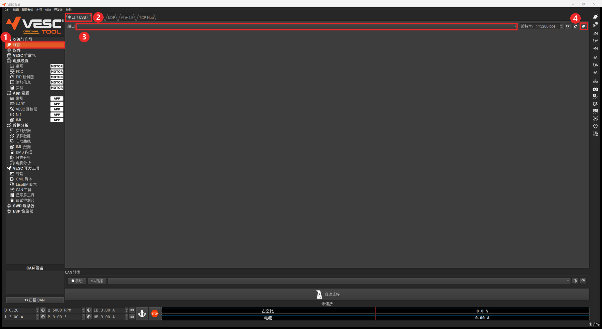

1. 左侧导航点 **连接**。
2. 选 **串口（USB）** 选项卡。
3. **端口**下拉框里选电调的 COM 口（不确定是哪个，就拔插一下 USB，看哪个出现又消失）。
   USB 连接时波特率不用管。
4. 点最右边的**连接**按钮（插头图标）。

也可以直接点欢迎页「快速配置」里的 **自动连接**，它会逐个尝试串口。

**连接成功的标志**：右下角状态栏显示「已连接……」；左下角「CAN 设备」列表出现
`DIY_70_80 [本机]`。你的固件是 7.00、程序也是 7.00，所以**不会**出现「受限模式」字样。

---

## 2. 打开 FOC 电机配置向导

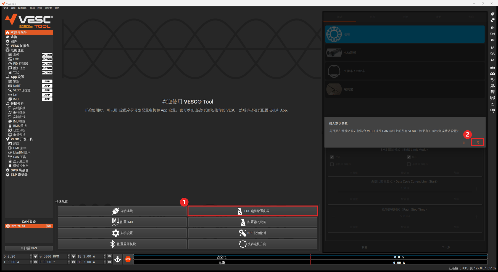

1. 左侧点 **欢迎与向导**，再点「快速配置」里的 **FOC 电机配置向导**。
   向导显示在右侧面板里（没连接时会提示「未连接……请先连接 VESC」）。
2. 弹出「载入默认参数」：**第一次配置选「是」**。它会把电调的电机配置和 App 配置恢复成出厂默认，
   避免以前改乱的参数影响识别。已经调好的板子不想被覆盖就选「否」。

## 3. 用途

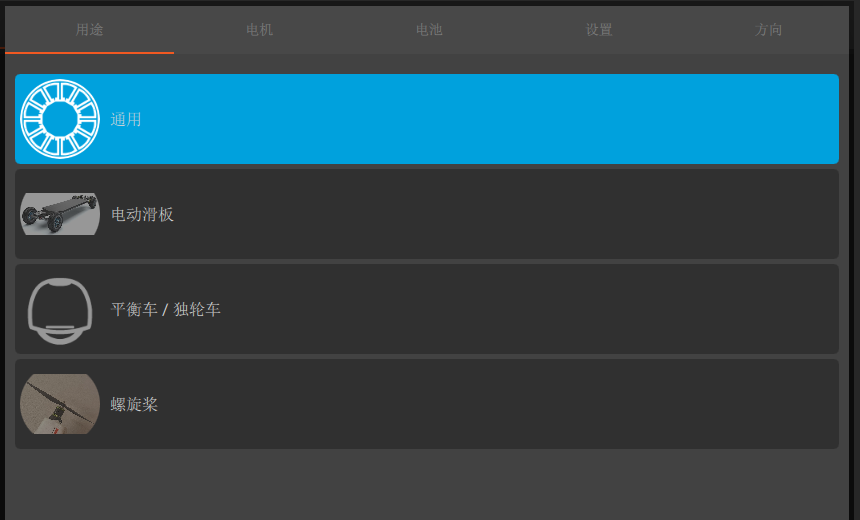

台架测试选 **通用**。「电动滑板」「平衡车 / 独轮车」「螺旋桨」会顺带改启动方式、故障停机时间等。
点 **下一步**。

## 4. 电机

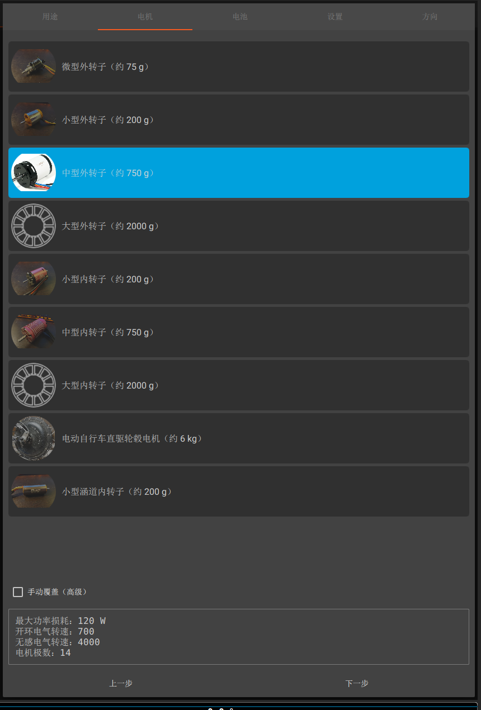

**选一个和你的电机尺寸最接近的型号**，下方会显示这一档的参数：

- **最大功率损耗**：决定识别出来的电机电流上限，电流上限 = √(功率损耗 ÷ 电阻 ÷ 1.5)。
  选得比实际电机大很多，电流上限就会偏大，**有烧电机的风险**。
- **开环电气转速 / 无感电气转速**：识别磁链时开环拖动的转速。
- **电机极数**：见第 6 步。

勾选「手动覆盖（高级）」可以自己改这几个数。点 **下一步** 会弹一次警告，确认后继续：

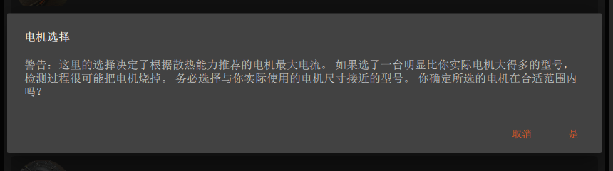

## 5. 电池

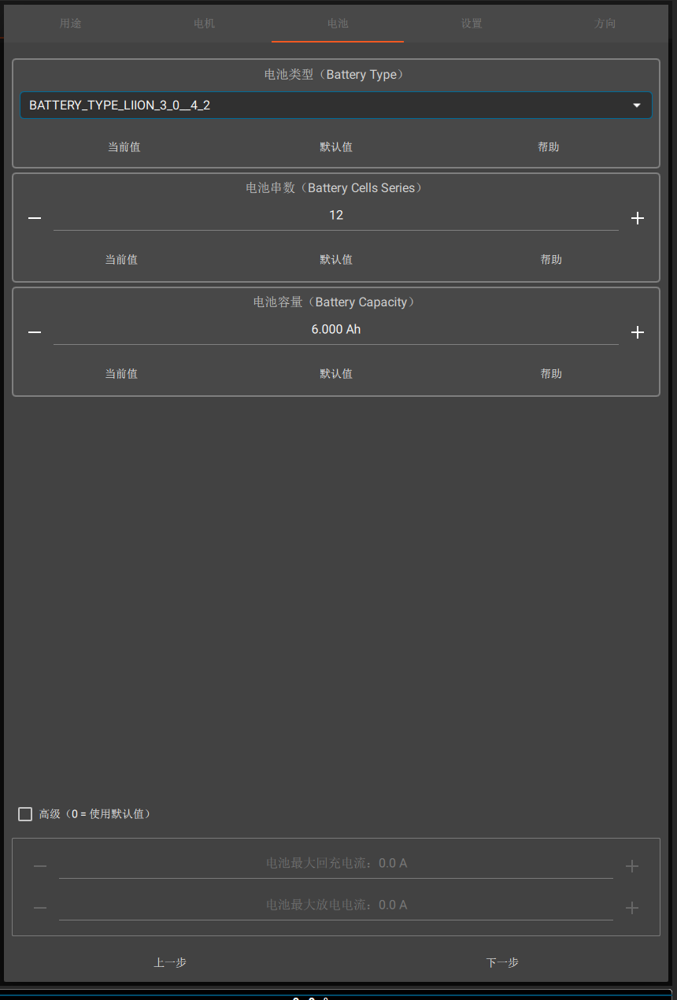

- **电池类型**：锂电选 `BATTERY_TYPE_LIION_3_0__4_2`，磷酸铁锂选 `..._LIIRON_2_6__3_6`
  （这是固件里的枚举名，刻意没翻）。
- **电池串数**：向导会按当前电压自动估一个值（39～51 V 时填 12），**一定要核对**，
  它决定低压保护的截止电压。
- **电池容量**：只影响电量显示。
- 「高级（0 = 使用默认值）」里可以单独限制电池放电 / 回充电流，一般留 0。

点 **下一步**，会提示「没有指定电池电流限值」，点 **确定**。

## 6. 设置

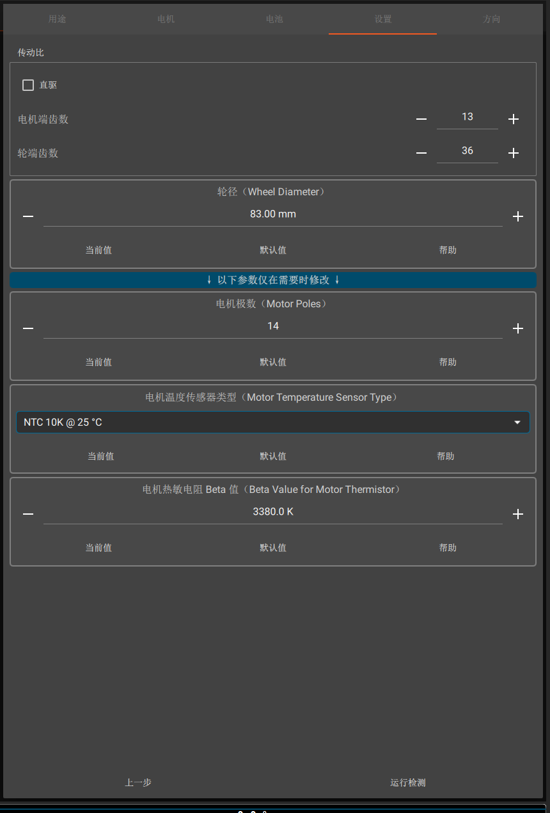

- **传动比 / 轮径**：只影响速度（km/h）换算，台架测试不用管。
- **电机极数**：**必须和实际一致**。数一下转子上的磁铁块数就是极数（常见 14 极 = 7 对极）。
  极数错了，识别不受影响，但速度、转数显示会错。
- 电机温度传感器：没接温度传感器就不用管。

## 7. 运行检测（识别电机参数）

点 **运行检测**，弹出确认框：

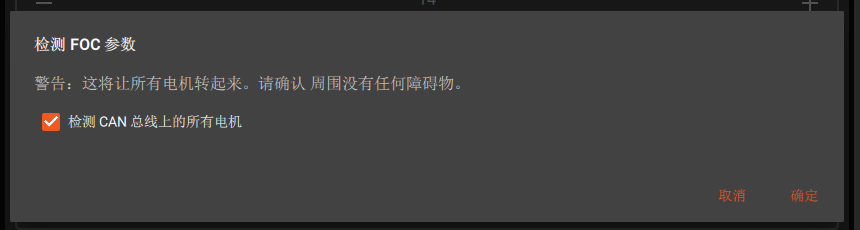

「检测 CAN 总线上的所有电机」只有多个电调通过 CAN 相连时才有用，单个电调勾不勾都行。
点 **确定** 后电机会先发出「滋滋」的测量声（测电阻、电感），然后转起来（测磁链），大约十几秒：


**识别成功**会弹出结果：

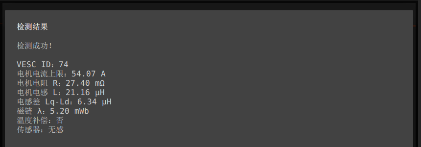

| 项 | 含义 |
|---|---|
| 电机电流上限 | 按所选电机档位和测得的电阻算出的相电流上限（不会超过硬件上限 80 A） |
| 电机电阻 R / 电感 L / 电感差 Lq-Ld | 电机绕组参数，FOC 电流环用 |
| 磁链 λ | 反电动势常数，无感观测器用 |
| 传感器 | 检测到的位置传感器；没接霍尔 / 编码器就是「无感」 |

**识别出的参数已经由固件写入电调并保存**，掉电不会丢，不需要再点「写入」。

**识别失败**时会弹出「检测失败，原因：……」，按提示处理，常见的：

| 失败原因 | 处理 |
|---|---|
| 欠压故障 | 电源限流不够或电压太低。调大电源限流、换满电的电池 |
| 过流故障 | 检查相线有无短路；选的电机档位是否太大 |
| 磁链检测失败 | 电机被卡住或带了负载，卸掉负载后重试。仍失败就回到第 4 步换一个更接近的电机档位，或勾「手动覆盖」调整开环电气转速后再试 |
| DRV 故障 / MOSFET 过温 | 硬件问题，先检查有无短路、让电调降温 |

## 8. 方向

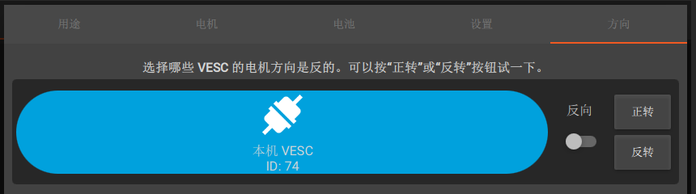

点 **正转**：电机以 10% 占空比转 2 秒（**会转起来**）。方向不对就打开「反向」开关，再试一次。
点 **完成**，向导结束。

## 9. 核对参数（可选）

左侧 **电机设置 → FOC**，能看到刚识别出的参数，传感器模式为「无感」：

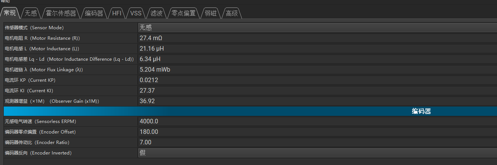

如果之后在这些页面里**手动改了参数**，要点右侧工具栏的 **⇡M（写入电机配置）** 才会下发到电调。

---

## 10. 用速度控制启动电机

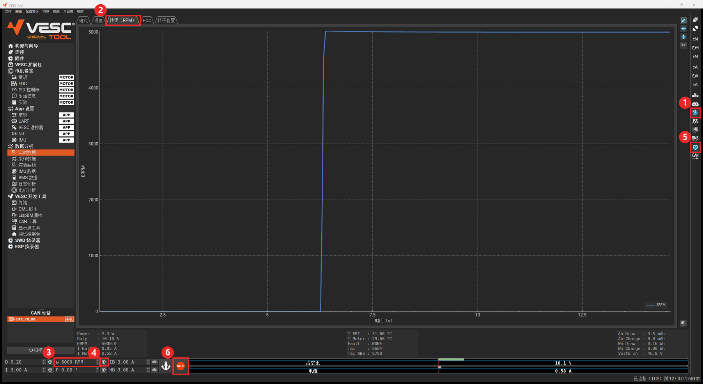

1. **打开实时数据**：点右侧工具栏的 **RT** 按钮（变蓝）。
   **不打开的话，实时数据页和仪表盘上的数值会一直是 0**，容易误以为电机没转。
2. （可选）左侧 **数据分析 → 实时数据**，选 **转速（RPM）** 选项卡看转速曲线。
3. 窗口左下角 **ω** 框里输入目标转速，例如 `5000`。
   - 单位是**电气转速 ERPM** = 机械转速 × 极对数。14 极（7 对极）电机：5000 ERPM ≈ 714 转/分。
   - **必须大于 900**（「最小电气转速」，在 PID 控制器页），低于它电机不转。
   - 输入负数就是反转。
4. 点 ω 右边的 **▶** 按钮，电机加速到目标转速并保持。改数值后再点一次 ▶ 即可调速。
5. **保活**（心形图标）会自动打开并变蓝。它每隔一段时间告诉电调「我还连着」，
   关掉的话电机会在 1 秒内超时停机 —— 这是保护，不用手动开关。
6. **停止**：点红色 **STOP**（或按键盘 **Esc**）。

> ⚠ **STOP 之后 5 秒内再点 ▶，电机不会响应** —— STOP 会让固件「急停」5 秒，期间忽略一切控制命令。
> 等 5 秒再启动即可。时长可在「编辑 → 首选项 → 急停持续时间」里改。

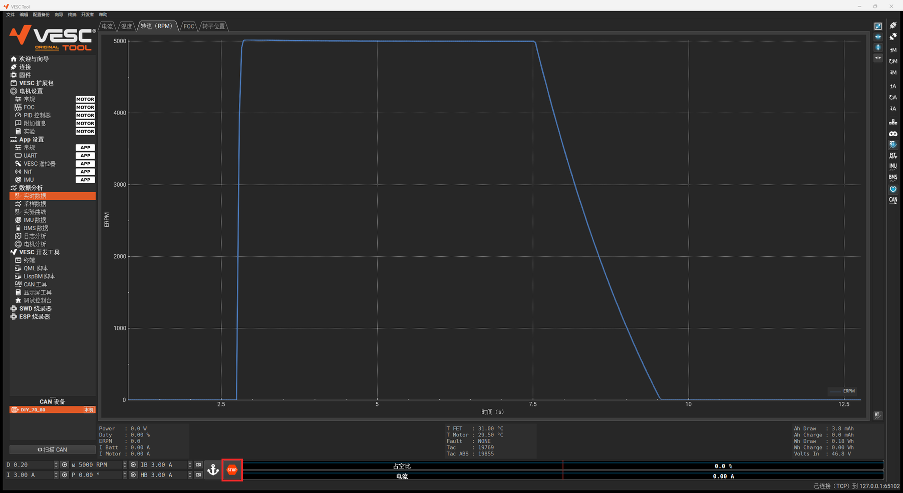

回到 **欢迎与向导** 页，右侧仪表盘同样会实时显示电流、功率、占空比、温度等：

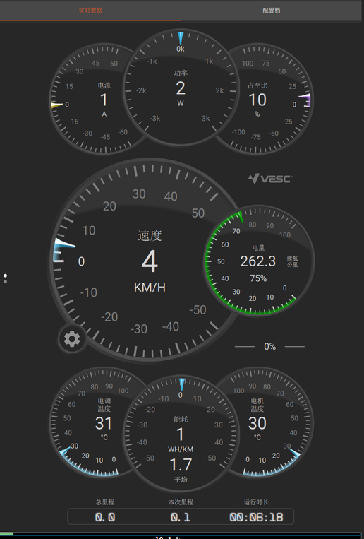

### 转速环调参

**电机设置 → PID 控制器** 页的「速度控制器」一组就是转速环：

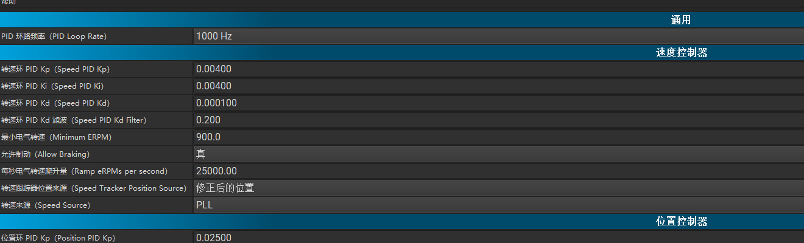

- 转速来回振荡：调小 **转速环 PID Kp**；
- 响应慢、有稳态误差：适当加大 **Kp / Ki**；
- **最小电气转速**（默认 900 ERPM）：低于它转速环不工作；
- **每秒电气转速爬升量**：目标转速变化的斜率，调小可以让加减速更平缓。

改完点右侧工具栏 **⇡M（写入电机配置）** 生效。

### 底部控制栏的其它按钮

| 框 | 作用 |
|---|---|
| **D** | 占空比控制（0.20 = 20% 占空比），不闭环 |
| **I** | 电流（转矩）控制，空载时会一直加速，小心 |
| **ω** | 转速控制（本教程用的） |
| **P** | 位置控制，需要编码器 |
| **IB** | 刹车电流 |
| **HB** | 手刹电流（低速保持） |
| ⚓ | 全力制动（占空比 0） |
| **STOP** | 停止 + 急停 5 秒 |

每个框右边的 ▶ 发送对应命令。右侧两根指示条实时显示占空比和电流。

---

## 常见问题

| 现象 | 原因 / 解决 |
|---|---|
| 欢迎页右侧空白，FOC 向导点了没反应 | v1.1 的打包缺库，换 v1.2 整个目录 |
| 仪表盘、曲线全是 0 | 没开右侧工具栏 **RT** |
| STOP 后电机启动不了 | 急停 5 秒，等一下 |
| 给了转速电机不转 | 目标低于 900 ERPM；或还在急停的 5 秒内 |
| 转速和转速表对不上 | ω 是电气转速 ERPM，要除以极对数 |
| 旧版对话框（菜单「向导 → FOC 电机配置向导（旧版）」）识别后电池串数变成 3 | 旧版对话框打开时会把串数写成 3（上游如此），在「电池」一段改回实际串数；推荐用欢迎页的新版向导 |
| 固件页「下载最新」、扩展包商店用不了 | 确认 `libssl-1_1-x64.dll`、`libcrypto-1_1-x64.dll` 还在 exe 同目录（v1.2 已附带）；另外这些功能需要能访问 vesc-project.com |
